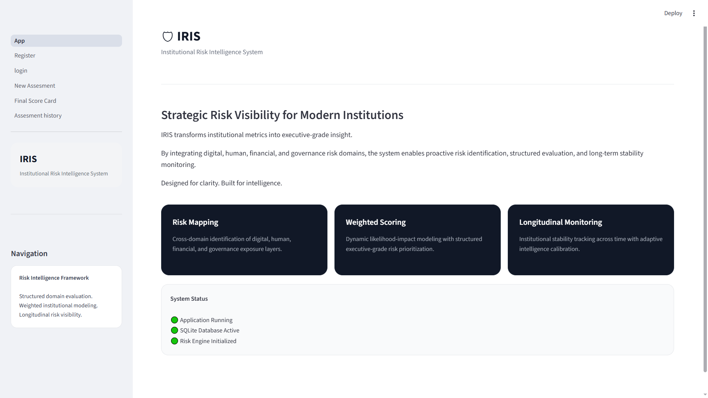
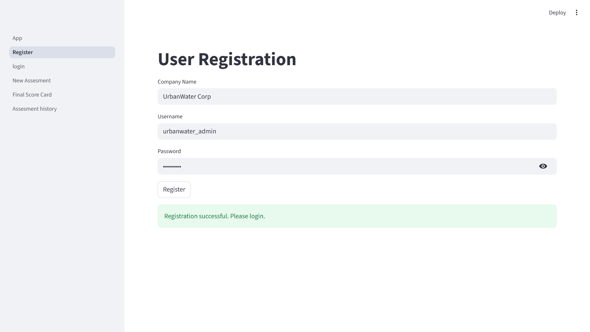
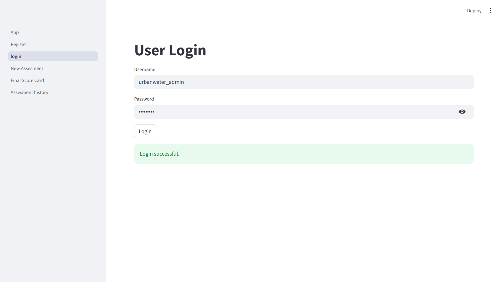
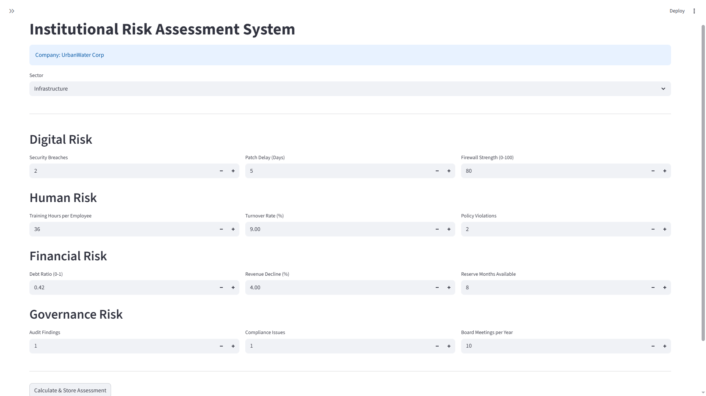
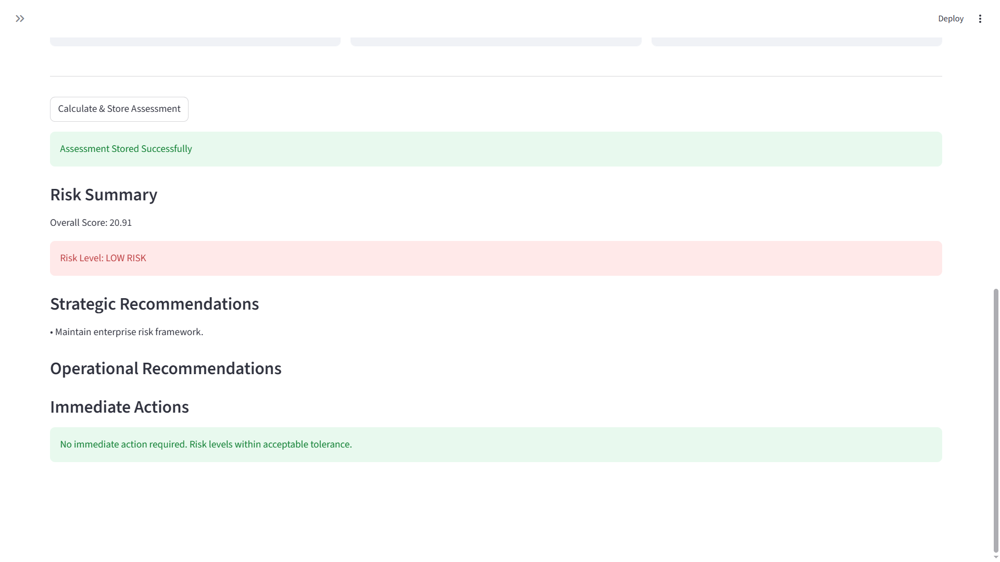
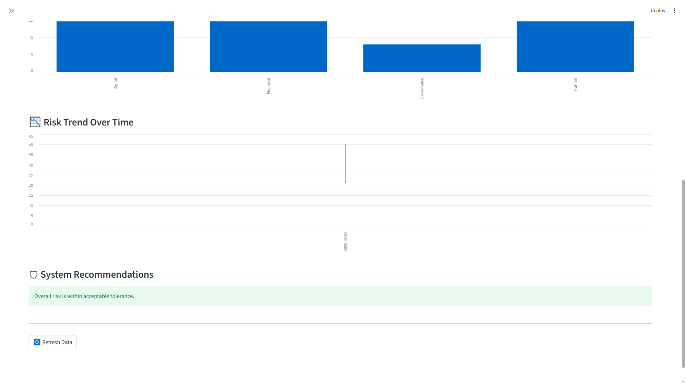
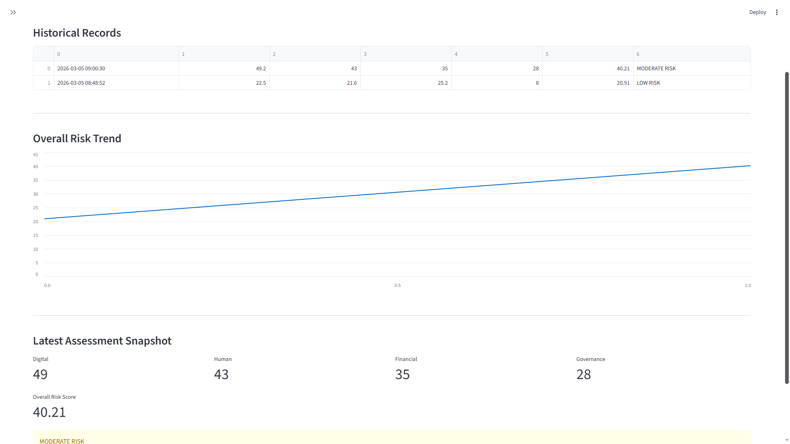

# Institutional Risk & Resilience Assessment Model (IRIS)

IRIS is a Streamlit-based web application designed to evaluate institutional resilience and operational risk through structured assessments.

## Why Use IRIS?

IRIS provides a structured digital platform for evaluating institutional resilience and operational risks.

Traditional risk assessments are often manual, time-consuming, and difficult to track over time. IRIS simplifies this process by offering an automated system that enables organizations to conduct assessments efficiently and monitor their resilience performance.

Key advantages of IRIS include:

• Structured and standardized risk assessment process  
• Automated resilience scoring and analysis  
• Historical tracking of assessments for trend analysis  
• Simple and intuitive web interface  
• Lightweight system that can run locally without complex infrastructure  

The system helps organizations identify vulnerabilities, improve decision-making, and strengthen operational resilience.

## Project Preview

### Landing Page

### Registration Page

### Login Page

### Risk Assessment Form

### Assessment Continued

### Risk Score Analysis

### Assessment History

## Features

- Company registration system
- Secure user login
- Institutional risk assessment questionnaire
- Automated resilience scoring
- Risk report generation
- Assessment history tracking
- User-specific data isolation

## Technologies Used

- Python
- Streamlit
- SQLite
- Pandas

## Project Structure

App.py – Main application entry point

database.py – Database connection and table creation

pages/
- 0_Register.py – User registration
- 1_login.py – Login system
- 2_New_Assessment.py – Risk assessment form
- 3_Final_Score_Card.py – Risk score calculation
- 4_Assessment_history.py – Previous assessment history

## How to Run the Project

Install dependencies:

pip install streamlit pandas

Run the application:

streamlit run App.py

## Purpose

The Institutional Risk & Resilience Assessment Model helps organizations evaluate their operational resilience by analyzing risk indicators across different domains.

The system provides automated scoring and recommendations to support better institutional risk management.
The Institutional Risk & Resilience Assessment Model helps organizations evaluate their operational resilience by analyzing risk indicators across different domains.

The system provides automated scoring and recommendations to support better institutional risk management.
